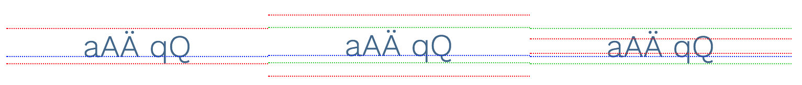
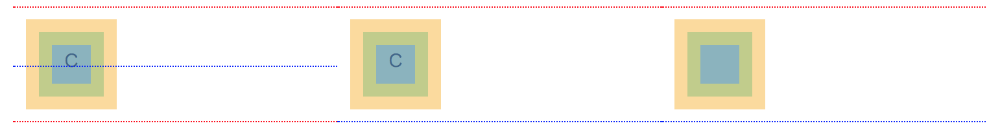
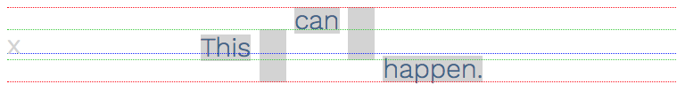
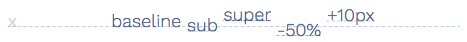
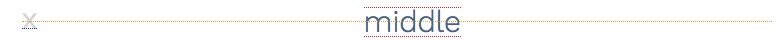
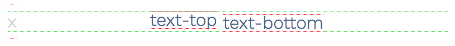
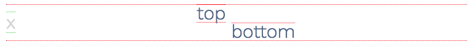
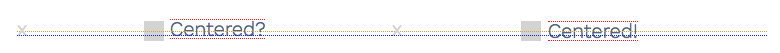

### CSS属性：vertical-align

> @ 2018-06-13

#### 1. 起作用的元素——行内元素

- inline
- inline-block
- inline-table(table-cell)

#### 2. 基线与外边界

##### inline elements



- 图为三行文本
- 红线：**line-height** 行高的顶边和底边——行内元素的**外边界**由此来决定
- 绿线：font-size 字体高度
- 蓝线：**baseline** 基线。大致来说，基线总是穿过**字体高度一半以下**的某一点。 

##### inline-block elements



- 图从左到右为：inline-block元素包含流内容"c"、inline-block元素包含流内容"c"以及overflow:hidden、inline-block元素不包含流内容但是内容区有高度
- 红线：**margin** 外边距的边界——行内块元素的**外边界**由此来决定
- 蓝线：baseline 基线——取决于元素是否包含流内容
  - 有流内容：基线就是最后一个流内容元素（last content element）本身的基线（左）
  - 有流内容但overflow不为visibale：基线就是margin-box的底部，也就是行内块元素的底部边缘（中）
  - 没有流内容：基线就是margin-box的底部（右）
- 黄色：border 边框
- 绿色： padding 内边距
- 蓝色： content 内容区

##### line box



- 图为一个line box(行盒子)
- 红色：**行盒子**。顶边与该行中最顶部元素的顶边重合，底边与该行元素中最底部元素的底边重合
- 绿色：**text box** 行盒子的文本盒子的上、下边
- 蓝色： **baseline** 基线
  - 确定基线位置的方法：在此行的开头，加上一个字母，如图中的“x”，如果这个字母没有被设置align，它默认就在基线上
- 灰色背景：text element 文本元素的区域

#### 3. vertical-align的值

- 将元素的基线对齐到 line box 的基线

  

  - baiseline：元素的基线与行盒子基线重合
  - sub：元素的基线移动至行盒子基线的下方
  - super：元素的基线移动至行盒子基线的上方
  - `<perventage>`：元素的基线相对于行盒子的基线进行上下移动，移动距离为line-height的百分比
  - `<length>`：元素的基线相对于行盒子基线进行上下移动的距离

- 将元素的外边界对齐到 line box 的基线

  

  - middle：元素上下边缘的中点------行盒子的基线加上x元素的高度的一半-----对其

- 将元素的外边界对齐到 line box 的 text box

  

  - text-top：元素的上边缘对齐到 line box的 text box 上边缘
  - text-bottom：元素的下边缘对齐到 line box的 text box 下边缘

- 将元素的外边界对齐到 line box 的外边界

  

  - top：元素的上边缘对齐到 line box 的上边缘
  - bottom：元素的下边缘对齐到 line box 的下边缘

#### 4. 场景

##### 居中图标之后，文本与图标看起来不居中对齐



```css
<span class="icon middle"></span>
<span>Centered?</span>

<span class="icon middle"></span>
<span class="middle">Centered!</span>

<style type="text/css">
  .icon   { display: inline-block;
            /* size, color, etc. */ }

  .middle { vertical-align: middle; }
</style>
```

- icon图标为inline-block，vertical-align:middle——导致图标上下边缘的中点与行盒子的基线加上x元素的高度的一半对齐，也就是居中了
- 文本为inline，左侧的文本位于基线上，如此，小写字母对齐了，但是大写字母会冒出头来；右侧的文本设置了vertical-align:middle，导致文本上下边缘的中点与行盒子的基线加上x元素的高度的一半对齐，也就是居中了

#### 5.  vertical-align揭秘

如果vertical-align没有大小效果，只要想想下面的问题就能找到症结所在

- 行盒子的基线，上下边界在哪
- 行内元素的基线，上下边界在哪


> 原文链接：http://christopheraue.net/design/vertical-align

> 译文链接：https://zcfy.cc/article/vertical-align-all-you-need-to-know