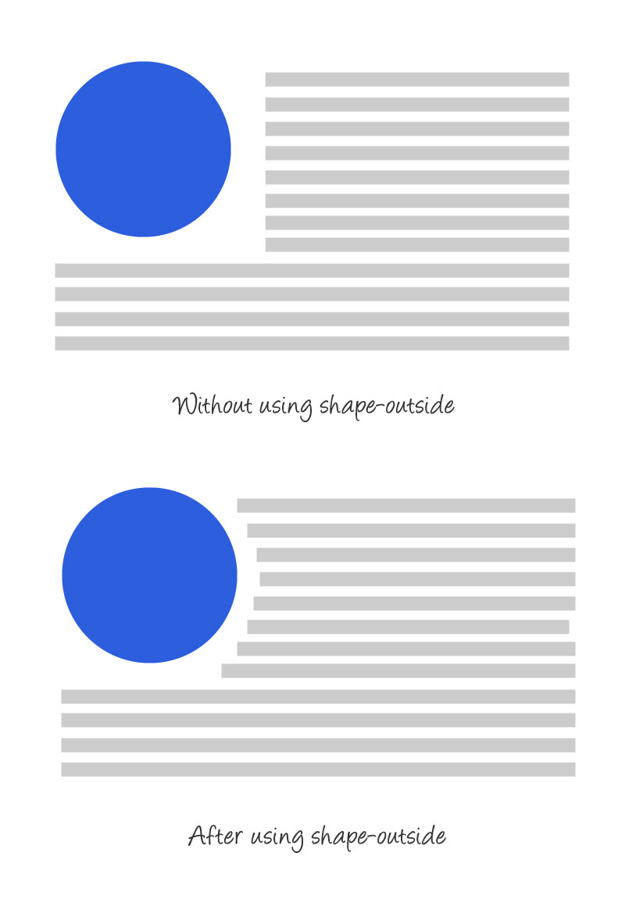

### CSS属性：shape-outside

> @2018-05-14

> [Github Demo1](https://zhangwanqin357.github.io/demo-preview/css-demos/12.css%E5%B1%9E%E6%80%A7shape-outside%E5%B1%9E%E6%80%A7%E5%AE%9E%E7%8E%B0%E6%96%87%E5%AD%97%E7%8E%AF%E7%BB%95.html)  

>  [Github Demo2](https://zhangwanqin357.github.io/demo-preview/css-demos/12.css%E5%B1%9E%E6%80%A7shape-outside%E5%B1%9E%E6%80%A7%E5%AE%9E%E7%8E%B0%E6%96%87%E5%AD%97%E7%8E%AF%E7%BB%95-demo.html)

#### 1. 作用：shape-outside属性定义了内容会如何围绕浮动元素展示

#### 2. 生效条件：

- 针对浮动元素
- 元素必须有指定的宽高

#### 3. 属性格式:

- shape-outside: none | [`<basic-shape>`   `<shape-box>`] | `<image> `| initial (浮动区域不受影响) | inherit 

- `<shape-box>` ：指定哪一个盒模型，添加在属性的**最后面** （如 shape-outside: circle(50% at 10px 10px) border-box;）

    - margin-box
    - border-box
    - padding-box
    - content-box

- `<basic-shape>`

    - inset()：矩形

      - 参数：top,right,bottom,left,border-radius,表示各个方向的参数参照浮动元素的边缘的偏移量
      - 如：inset(30px 50px 30px 0 round 37%);

    - circle()：圆形

      - 参数：圆形半径（浮动元素的长宽的50%），浮动元素的盒模型中心坐标

      - 如：circle(50% at 10px 10px);

    - ellipse()：椭圆形

      - 参数：x轴半径，y轴半径，浮动元素的盒模型中心点位置

      - 如：ellipse(50px 100px at 0 50%);
      - 与clip-path结合使用可以实现真正的椭圆形

    - polygon()：多边形

      - 参数：多边形各个定点的坐标
      - 如： polygon(0 0, 0 200px, 200px 200px);
      - 多边形还可以添加transition动画

- `<image>`: 指定那一张图片用来文字软绕

    - url(): 
      - 结合shape-image-threshold: 0.5;使用，意思是浮动元素形状的边缘根据给定的透明度来决定

#### 

> 参考链接1：https://css-tricks.com/almanac/properties/s/shape-outside/

> 参考链接2：https://tympanus.net/codrops/css_reference/shape-outside/