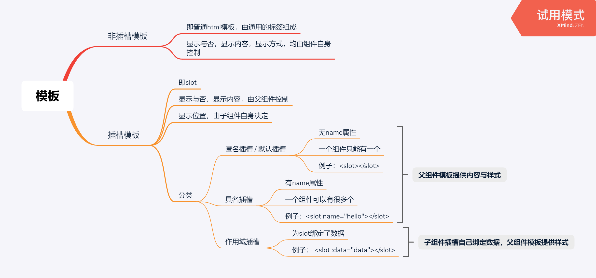
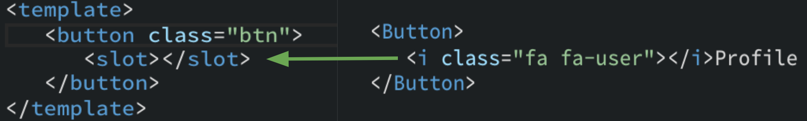
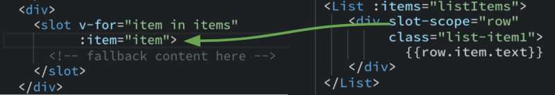
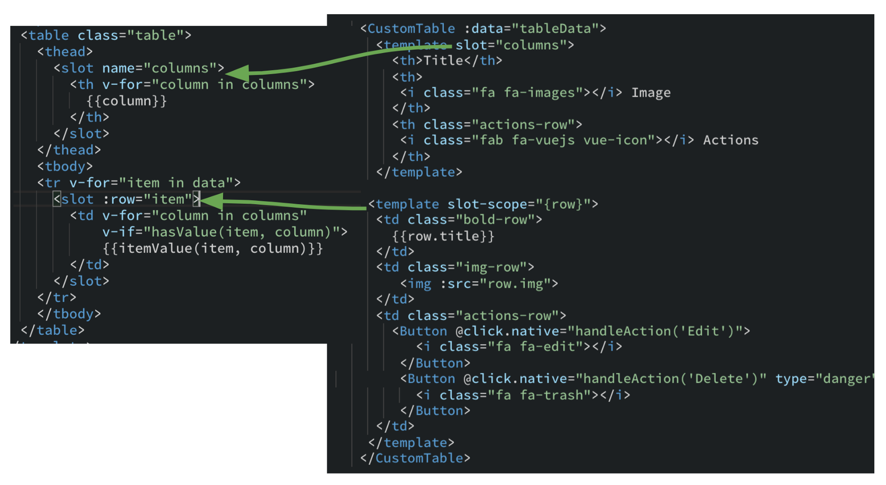

### 作用域插槽：slot-scope

#### 1. 前言

- 废话不多说，看图（如看不清楚，可以在浏览器右键--在新标签页中打开图片）

#### 2. 举例

- 再多的文字都没有一个例子直白，所以借用[Understanding scoped slots in Vue.js](https://medium.com/binarcode/understanding-scoped-slots-in-vue-js-db5315a42391)这篇文章里面的例子
- 👇说明：这是一个**匿名插槽**，引用Button组件的时候，`<i>`标签会直接替代`<slot>`标签

- 👇 说明：这是一个简单的**作用域插槽**
  1. 父组件引用`<List>`组件的时候，传入`items`参数
  2. 在子组件`<List>`内部，遍历`items`，将每一个`item`传入`<slot>`里（注：**为`<slot>`绑定数据，此`<slot>`就成为了一个作用域插槽**）
  3. 在父组件里，通过`slot-scope`接收一个参数，可以是`props`，`row`，`slotProps`等等任何你想要的名字
  4. 然后就可以通过`props.item`，`row.item`，`slotProps.item`等访问到`<slot>`中传入的`item`了

- 👇 说明：这是一个**具名插槽**和一个**作用域插槽**的组合
  1. 具名插槽
     - 子组件`<slot name="columns">`
     - 父组件`<template slot="columns">`
     - 结果就是父组件中的模板替代子组件`<slot>`里的内容
  2. 作用域插槽

> 参考链接1：https://medium.com/binarcode/understanding-scoped-slots-in-vue-js-db5315a42391 

> 参考链接2：https://juejin.im/post/5a69ece0f265da3e5a5777ed

