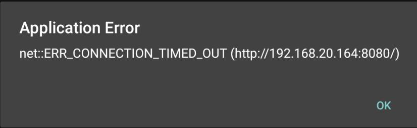

## 安卓输入框被软键盘遮住的问题
```javascript
if(/Android [4-7]/.test(navigator.appVersion)) {
   window.addEventListener("resize", function() {
      if(document.activeElement.tagName=="INPUT" || document.activeElement.tagName=="TEXTAREA") {
         window.setTimeout(function() {
            document.activeElement.scrollIntoViewIfNeeded();
         },0);
      }
   })
}
```

参考链接：[Android does not correctly scroll on input focus if not body element](https://stackoverflow.com/questions/23757345/android-does-not-correctly-scroll-on-input-focus-if-not-body-element)

## 项目启动报错：Application Error  net::ERR_CONNECTION_TIMED_OUT

- 环境：Cordova+Vue开发安卓app, 电脑连接真机开发。
- 错误出现时机：项目打包成功，并且launch success，app启动之后立即弹出。
- 出现原因：公司断电之后，电脑IP重新分配，内网IP变化。
- 解决方法：
  - 首先ping一下原IP是否被占用，占用了就要空出原IP，再将当前电脑IP改为原IP；
  - 控制面板 > 网络和Internet > 网络和共享中心 > 更改适配器设置 > 选择当前网络双击 > 属性 > Internet协议版本4（TCP/IPv4）> 设定为固定IP（注意，一旦出现这个问题，**将IP设置为出现问题之前的IP**）。


